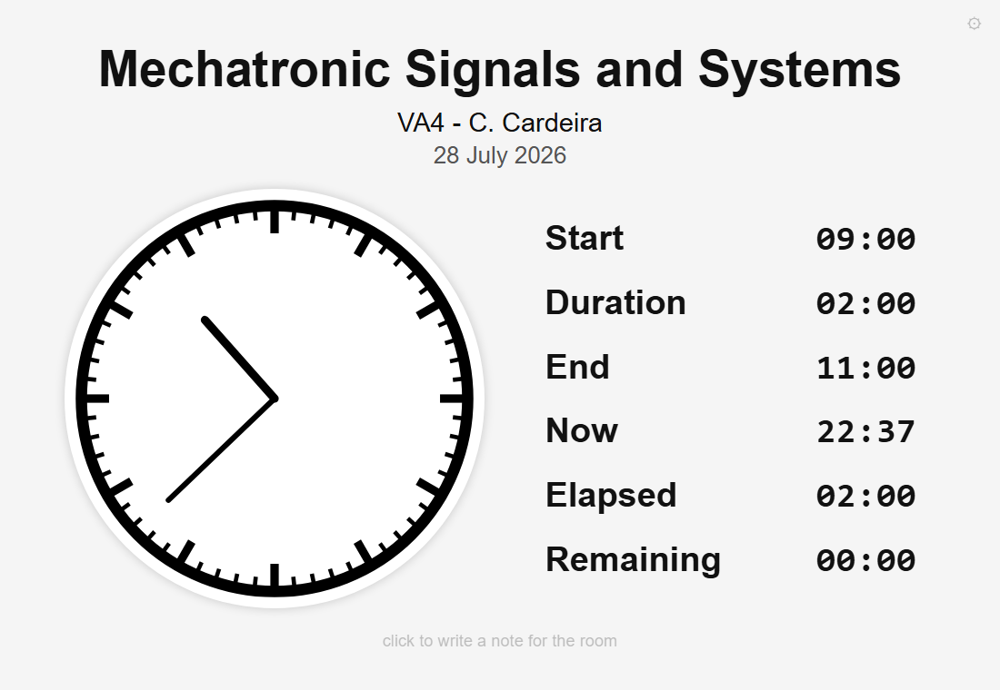

# Exam Clock

A wall clock for the exam room, meant to be projected: the time of day on an
analogue dial, and next to it the times that matter during a written exam, which
are when it started, when it ends, how much has gone and how much is left.

One HTML file. No server, no installation, no dependencies, no network. Open it
and it works, reading the clock of the machine it is opened on.

**Try it: <https://carloscardeira.github.io/exam-clock/>**, or download
`exam-clock.html` and keep it: it runs the same with the network unplugged.



## Why

Invigilators improvise: a phone, a laptop clock, a number written on the board and
rubbed out and written again. What a room needs is a single surface that says the
same thing to everybody, that can be read from the back row, and that can be
corrected in one keystroke when the exam is extended for all.

## Use

Open `exam-clock.html` in a browser and project it. Full screen with `F11`.
Extend the display rather than mirroring it, so the machine stays usable.

Everything on the page is edited by clicking on it: the course, the room, the
invigilator, the date, the start time, the duration and a free note for the room.
The end time follows from the start and the duration, so it is not edited.

Settings, and the list of keys, are in the button in the top corner or on `h`.
The button fades away after a few seconds without mouse or keyboard, so the room
is left with the clock alone.

### Keys

| Key | What it does |
|---|---|
| click | edit any field on the page |
| `1` / `3` | add 15 / 30 minutes |
| `!` / `#` | take away 15 / 30 minutes |
| `+` / `-` | add or take away 5 minutes |
| `p` | pause and resume |
| `s` | second hand, and seconds in the times |
| `e` | cycle what happens in the final minute |
| `l` | switch language (English, Portuguese) |
| `[` / `]` | smaller / larger clock |
| `,` / `.` | smaller / larger text |
| `f` | next font |
| `h` or `?` | settings and this list |

### Pausing

`p` stops the exam clock, for a fire alarm or any other interruption. Elapsed and
remaining freeze, and the end time moves forward in real time for as long as the
pause lasts, so the room can see the new finishing time. Resuming leaves the end
displaced by exactly the time that was lost.

### The final minute

Nothing happens at the end unless it is asked for. The default is deliberate: a
countdown turning red concentrates the mind of whoever is already panicking. For
those who want a cue there are three, on `e`: the remaining time pulses, a red arc
on the dial empties over the last minute, or both. With a cue switched on, the
remaining time also counts seconds during that minute.

### One link per room

Settings can travel in the address, which removes the need to keep one file per
room:

```
exam-clock.html?course=Mechatronic%20Signals&room=VA4&invigilator=C.%20Cardeira&start=09:30&duration=2:00&lang=en
```

Accepted: `course`, `room`, `invigilator`, `date`, `start`, `duration`, `lang`,
`seconds`, `ending`. Portuguese spellings work too (`sala`, `vigilante`, `inicio`,
`duracao`). What is not given falls back to what the browser remembers, and then
to the defaults.

## Privacy

The page makes no network requests of any kind. Settings are kept in the browser
that opened it, and nothing is sent anywhere. It works with no internet at all,
which also means it works in a room where the network does not.

## Language

English and Portuguese, switched on `l` or in the settings. The date follows the
language. Adding a language is a matter of one more entry in the `STRINGS` object
at the top of the script.

## Cite

[](https://doi.org/10.5281/zenodo.21675520)

If this is useful in your teaching, please cite it:

> Cardeira, C. (2026). *Exam Clock: a projected clock for written examinations*
> (version 1.0.1) [Computer software]. Zenodo. https://doi.org/10.5281/zenodo.21675520

The DOI above is the concept DOI: it always resolves to the latest release. Each
release also has its own DOI, should you need to cite the exact version you used.
Machine-readable metadata is in `CITATION.cff`.

## Author

Carlos Cardeira, Instituto Superior Técnico, Universidade de Lisboa, and IDMEC.

## License

MIT. See `LICENSE`.
